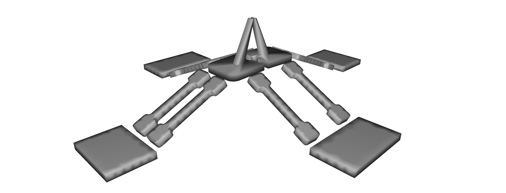

# Migribot



## Installation

### Required 

This project is using the simulation framework [SOFA](https://www.sofa-framework.org/). 
Binaries of SOFA with the required plugins are available [here](https://github.com/sofa-framework/sofa/releases). 
If you compile SOFA, checkout the following source code:

- [SOFA](https://github.com/sofa-framework/sofa) on branch master
- [SofaPython3](https://github.com/sofa-framework/SofaPython3) plugin for SOFA on branch master 
- [BeamAdapter](https://github.com/sofa-framework/BeamAdapter) plugin on branch master 
- [SoftRobots](https://github.com/SofaDefrost/SoftRobots) plugin on branch master 
- [SoftRobots.Inverse](https://github.com/SofaDefrost/SoftRobots.Inverse) plugin on branch master 
- [STLIB](https://github.com/SofaDefrost/STLIB) plugin on branch master

## How to

To run the simulation, in your terminal:
```bash
~$ cd TIRREX.Migribot
~/TIRREX.Migribot$ runSofa scene.py
```